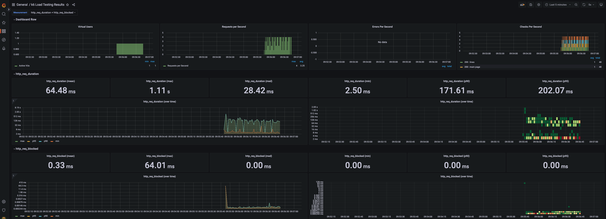
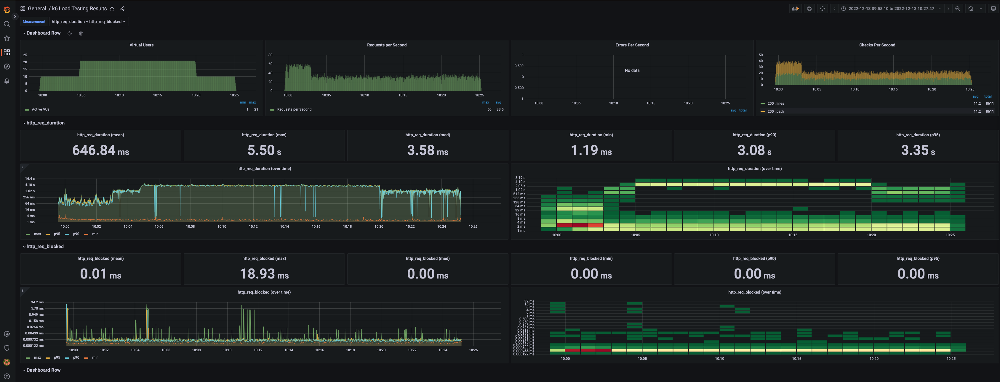
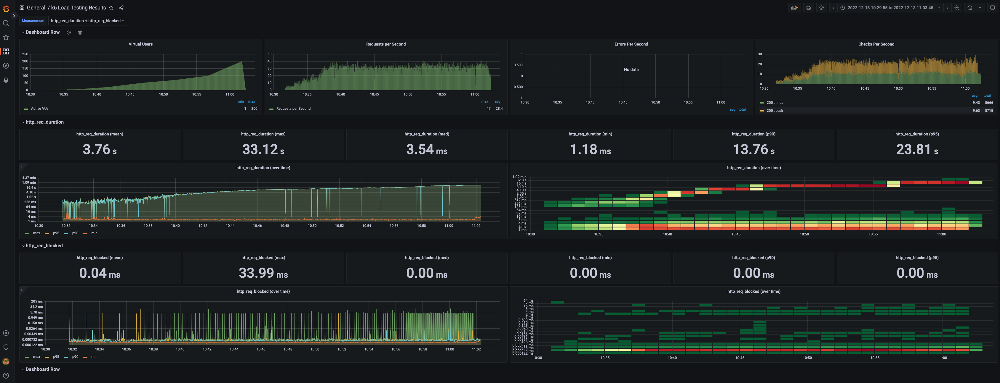

<p align="center">
    
</p>
<p align="center">
  
  
  <a href="https://edu.nextstep.camp/c/R89PYi5H" alt="nextstep atdd">
    
  </a>
  
</p>

<br>

# 인프라공방 샘플 서비스 - 지하철 노선도

<br>

## 🚀 Getting Started

### Install
#### npm 설치
```
cd frontend
npm install
```
> `frontend` 디렉토리에서 수행해야 합니다.

### Usage
#### webpack server 구동
```
npm run dev
```
#### application 구동
```
./gradlew clean build
```
<br>

## 미션

* 미션 진행 후에 아래 질문의 답을 작성하여 PR을 보내주세요.


### 1단계 - 화면 응답 개선하기
1. 성능 개선 결과를 공유해주세요 (Smoke, Load, Stress 테스트 결과)
#### smoke 


#### load


#### stress


2. 어떤 부분을 개선해보셨나요? 과정을 설명해주세요
- 가장 먼저 vendor.js의 로딩시 대기시간이 길다고 판단해서 async를 적용했습니다.
- http에 gzip을 적용해서 리소스를 압축해서 응답하도록 했습니다.
- cache와 TLS, HTTP/2 설정을 진행했습니다.
```
events {}

http {
  gzip on;
  gzip_comp_level 9;
  gzip_vary on;
  gzip_types text/plain text/css application/json application/x-javascript application/javascript text/xml application/xml application/rss+xml text/javascript image/svg+xml application/vnd.ms-fontobject application/x-font-ttf font/opentype;

  upstream app {
    server 172.17.0.1:8080;
  }

  proxy_cache_path /tmp/nginx levels=1:2 keys_zone=mycache:10m inactive=10m max_size=200M;
  proxy_cache_key "$scheme$host$request_uri $cookie_user";
  server {
        location ~* \.(?:css|js|gif|png|jpg|jpeg)$ {
            proxy_pass http://app;

            ## 캐시 설정 적용 및 헤더에 추가
            # 캐시 존을 설정 (캐시 이름)
            proxy_cache mycache;
            # X-Proxy-Cache 헤더에 HIT, MISS, BYPASS와 같은 캐시 적중 상태정보가 설정
            add_header X-Proxy-Cache $upstream_cache_status;
            # 200 302 코드는 20분간 캐싱
            proxy_cache_valid 200 302 10m;
            # 만료기간을 1 달로 설정
            expires 1M;
            # access log 를 찍지 않는다.
            access_log off;
        }
    }


  # Redirect all traffic to HTTPS
  server {
    listen 80;
    return 301 https://$host$request_uri;
  }
  server {
    listen 443 ssl http2;
    ssl_certificate /etc/letsencrypt/live/92soojong.o-r.kr/fullchain.pem;
    ssl_certificate_key /etc/letsencrypt/live/92soojong.o-r.kr/privkey.pem;

    # Disable SSL
    ssl_protocols TLSv1 TLSv1.1 TLSv1.2;

    # 통신과정에서 사용할 암호화 알고리즘
    ssl_prefer_server_ciphers on;
    ssl_ciphers ECDH+AESGCM:ECDH+AES256:ECDH+AES128:DH+3DES:!ADH:!AECDH:!MD5;

    # Enable HSTS
    # client의 browser에게 http로 어떠한 것도 load 하지 말라고 규제합니다.
    # 이를 통해 http에서 https로 redirect 되는 request를 minimize 할 수 있습니다.
    add_header Strict-Transport-Security "max-age=31536000" always;

    # SSL sessions
    ssl_session_cache shared:SSL:10m;
    ssl_session_timeout 10m;

    location / {
      proxy_pass http://app;
    }
  }
}
   

```


---

### 2단계 - 스케일 아웃

1. Launch Template 링크를 공유해주세요.

2. cpu 부하 실행 후 EC2 추가생성 결과를 공유해주세요. (Cloudwatch 캡쳐)

```sh
$ stress -c 2
```

3. 성능 개선 결과를 공유해주세요 (Smoke, Load, Stress 테스트 결과)

---

### 3단계 - 쿼리 최적화

1. 인덱스 설정을 추가하지 않고 아래 요구사항에 대해 1s 이하(M1의 경우 2s)로 반환하도록 쿼리를 작성하세요.

- 활동중인(Active) 부서의 현재 부서관리자 중 연봉 상위 5위안에 드는 사람들이 최근에 각 지역별로 언제 퇴실했는지 조회해보세요. (사원번호, 이름, 연봉, 직급명, 지역, 입출입구분, 입출입시간)

---

### 4단계 - 인덱스 설계

1. 인덱스 적용해보기 실습을 진행해본 과정을 공유해주세요

---

### 추가 미션

1. 페이징 쿼리를 적용한 API endpoint를 알려주세요
